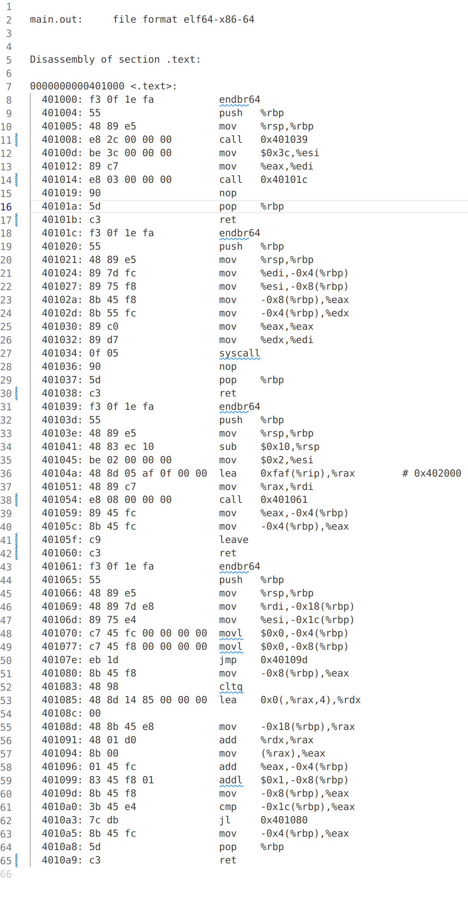
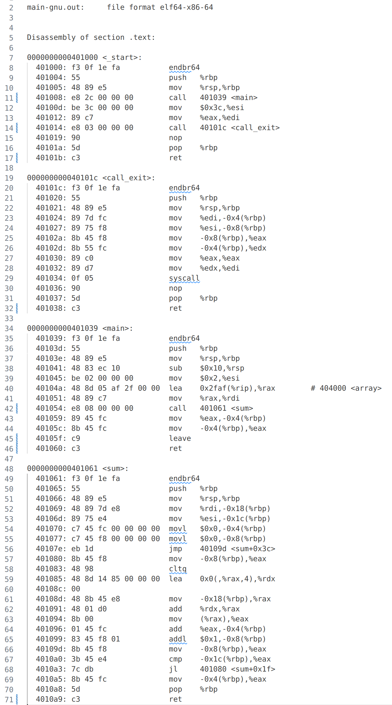

# UCSB CS293C Course Project - Simple Static Linker

This project realized a simple static linker through UCSB CS293C (Special Topics in Programming Languages) course in 2023 Spring. 

This linker successfully links several ELF object files (`.o` file) to an executable file on x86-64 Linux platform.

Course instructor: [Markus Mock](https://github.com/MarkusMock)

Project group member: [Zhaohui Yang](https://github.com/youngcius) and [Grace Zhang](https://github.com/gracsoo)


## Usage


## Result

There is a video demo https://drive.google.com/file/d/1n00N1DC503Ol_BSTi7pbVV3qyfLet1fB/view?usp=sharing.

By simply run `make` command, you will see output like:

```shell
─────────────────────────────────── Before merging and relocation ────────────────────────────────────
Relocation infos:
+-----+-----------+---------+-------------------------+--------+--------+------+
| Num | Symbol    | Section | Type                    | Offset | Addend | Size |
+-----+-----------+---------+-------------------------+--------+--------+------+
|   0 | main      | .text   | RELOCATION_X86_64.PLT32 |      0 |     -4 |   32 |
|   1 | call_exit | .text   | RELOCATION_X86_64.PLT32 |      0 |     -4 |   32 |
|   2 | array     | .text   | RELOCATION_X86_64.PC32  |      0 |     -4 |   32 |
|   3 | sum       | .text   | RELOCATION_X86_64.PLT32 |      0 |     -4 |   32 |
+-----+-----------+---------+-------------------------+--------+--------+------+

BSS sections:
+-----+------+----------------------+--------+------+----------+-------+---------+
| Num | Name | Type                 | Offset | Size | VirtAddr | Align | EntSize |
+-----+------+----------------------+--------+------+----------+-------+---------+
|   0 | .bss | SECTION_TYPES.NOBITS |    121 |    0 |        0 |     1 |       0 |
|   1 | .bss | SECTION_TYPES.NOBITS |    112 |    0 |        0 |     1 |       0 |
|   2 | .bss | SECTION_TYPES.NOBITS |    137 |    0 |        0 |     1 |       0 |
+-----+------+----------------------+--------+------+----------+-------+---------+

Text sections:
+-----+-------+------------------------+--------+------+----------+-------+---------+
| Num | Name  | Type                   | Offset | Size | VirtAddr | Align | EntSize |
+-----+-------+------------------------+--------+------+----------+-------+---------+
|   0 | .text | SECTION_TYPES.PROGBITS |     64 |   57 |        0 |     1 |       0 |
|   1 | .text | SECTION_TYPES.PROGBITS |     64 |   40 |        0 |     1 |       0 |
|   2 | .text | SECTION_TYPES.PROGBITS |     64 |   73 |        0 |     1 |       0 |
+-----+-------+------------------------+--------+------+----------+-------+---------+

Data sections:
+-----+-------+------------------------+--------+------+----------+-------+---------+
| Num | Name  | Type                   | Offset | Size | VirtAddr | Align | EntSize |
+-----+-------+------------------------+--------+------+----------+-------+---------+
|   0 | .data | SECTION_TYPES.PROGBITS |    121 |    0 |        0 |     1 |       0 |
|   1 | .data | SECTION_TYPES.PROGBITS |    104 |    8 |        0 |     8 |       0 |
|   2 | .data | SECTION_TYPES.PROGBITS |    137 |    0 |        0 |     1 |       0 |
+-----+-------+------------------------+--------+------+----------+-------+---------+

All symbols:
+-----+-----------------------+----------------------+------------------------+-------+------+-------+
| Num | Name                  | Type                 | Bind                   | Value | Size |   Ndx |
+-----+-----------------------+----------------------+------------------------+-------+------+-------+
|   0 |                       | SYMBOL_TYPES.NOTYPE  | SYMBOL_BINDINGS.LOCAL  |     0 |    0 |     0 |
|   1 |                       | SYMBOL_TYPES.SECTION | SYMBOL_BINDINGS.LOCAL  |     0 |    0 |     1 |
|   2 |                       | SYMBOL_TYPES.SECTION | SYMBOL_BINDINGS.LOCAL  |     0 |    0 |     2 |
|   3 |                       | SYMBOL_TYPES.SECTION | SYMBOL_BINDINGS.LOCAL  |     0 |    0 |     3 |
|   4 |                       | SYMBOL_TYPES.SECTION | SYMBOL_BINDINGS.LOCAL  |     0 |    0 |     4 |
|   5 | start.c               | SYMBOL_TYPES.FILE    | SYMBOL_BINDINGS.LOCAL  |     0 |    0 | 65521 |
|   6 | main.c                | SYMBOL_TYPES.FILE    | SYMBOL_BINDINGS.LOCAL  |     0 |    0 | 65521 |
|   7 | sum.c                 | SYMBOL_TYPES.FILE    | SYMBOL_BINDINGS.LOCAL  |     0 |    0 | 65521 |
|   8 | _GLOBAL_OFFSET_TABLE_ | SYMBOL_TYPES.NOTYPE  | SYMBOL_BINDINGS.GLOBAL |     0 |    0 |     0 |
|   9 | _start                | SYMBOL_TYPES.FUNC    | SYMBOL_BINDINGS.GLOBAL |     0 |   28 |     1 |
|  10 | call_exit             | SYMBOL_TYPES.FUNC    | SYMBOL_BINDINGS.GLOBAL |    28 |   29 |     1 |
|  11 | main                  | SYMBOL_TYPES.FUNC    | SYMBOL_BINDINGS.GLOBAL |     0 |   40 |     1 |
|  12 | sum                   | SYMBOL_TYPES.FUNC    | SYMBOL_BINDINGS.GLOBAL |     0 |   73 |     1 |
|  13 | array                 | SYMBOL_TYPES.OBJECT  | SYMBOL_BINDINGS.GLOBAL |     0 |    8 |     3 |
+-----+-----------------------+----------------------+------------------------+-------+------+-------+
```

```shell
──────────────────────────────────── After merging and relocation ────────────────────────────────────
Sections:
+-----+---------+------------------------+---------+------+----------+-------+---------+
| Num | Name    | Type                   |  Offset | Size | VirtAddr | Align | EntSize |
+-----+---------+------------------------+---------+------+----------+-------+---------+
|   0 | .text   | SECTION_TYPES.PROGBITS | 4198400 |  170 |  4198400 |     1 |       0 |
|   1 | .rodata | SECTION_TYPES.PROGBITS | 4202496 |    0 |  4202496 |     4 |       0 |
|   2 | .data   | SECTION_TYPES.PROGBITS | 4202496 |    8 |  4202496 |     1 |       0 |
|   3 | .bss    | SECTION_TYPES.NOBITS   | 4202504 |    0 |  4202504 |     1 |       0 |
+-----+---------+------------------------+---------+------+----------+-------+---------+

Symbols:
+-----+-----------------------+----------------------+------------------------+-------+------+-------+
| Num | Name                  | Type                 | Bind                   | Value | Size |   Ndx |
+-----+-----------------------+----------------------+------------------------+-------+------+-------+
|   0 |                       | SYMBOL_TYPES.NOTYPE  | SYMBOL_BINDINGS.LOCAL  |     0 |    0 |     0 |
|   1 |                       | SYMBOL_TYPES.SECTION | SYMBOL_BINDINGS.LOCAL  |     0 |    0 |     1 |
|   2 |                       | SYMBOL_TYPES.SECTION | SYMBOL_BINDINGS.LOCAL  |     0 |    0 |     2 |
|   3 |                       | SYMBOL_TYPES.SECTION | SYMBOL_BINDINGS.LOCAL  |     0 |    0 |     3 |
|   4 |                       | SYMBOL_TYPES.SECTION | SYMBOL_BINDINGS.LOCAL  |     0 |    0 |     4 |
|   5 | start.c               | SYMBOL_TYPES.FILE    | SYMBOL_BINDINGS.LOCAL  |     0 |    0 | 65521 |
|   6 | main.c                | SYMBOL_TYPES.FILE    | SYMBOL_BINDINGS.LOCAL  |     0 |    0 | 65521 |
|   7 | sum.c                 | SYMBOL_TYPES.FILE    | SYMBOL_BINDINGS.LOCAL  |     0 |    0 | 65521 |
|   8 | _GLOBAL_OFFSET_TABLE_ | SYMBOL_TYPES.NOTYPE  | SYMBOL_BINDINGS.GLOBAL |     0 |    0 |     0 |
|   9 | _start                | SYMBOL_TYPES.FUNC    | SYMBOL_BINDINGS.GLOBAL |     0 |   28 |     1 |
|  10 | call_exit             | SYMBOL_TYPES.FUNC    | SYMBOL_BINDINGS.GLOBAL |    28 |   29 |     1 |
|  11 | main                  | SYMBOL_TYPES.FUNC    | SYMBOL_BINDINGS.GLOBAL |    57 |   40 |     1 |
|  12 | sum                   | SYMBOL_TYPES.FUNC    | SYMBOL_BINDINGS.GLOBAL |    97 |   73 |     1 |
|  13 | array                 | SYMBOL_TYPES.OBJECT  | SYMBOL_BINDINGS.GLOBAL |     0 |    8 |     3 |
+-----+-----------------------+----------------------+------------------------+-------+------+-------+


```

```shell
─────────────────────────────────────────── after building ───────────────────────────────────────────
Sections:
+-----+---------+------------------------+--------+------+----------+-------+---------+
| Num | Name    | Type                   | Offset | Size | VirtAddr | Align | EntSize |
+-----+---------+------------------------+--------+------+----------+-------+---------+
|   0 |         | SECTION_TYPES.NULL     |      0 |    0 |        0 |     0 |       0 |
|   1 | .text   | SECTION_TYPES.PROGBITS |    232 |  170 |  4198400 |    32 |       0 |
|   2 | .strtab | SECTION_TYPES.STRTAB   |    410 |   15 |        0 |    32 |       0 |
+-----+---------+------------------------+--------+------+----------+-------+---------+

Segments:
+-----+--------------------+--------+----------+----------+--------+---------+-------+
| Num | Type               | Offset | VirtAddr | PhysAddr | MemSiz | FileSiz | Align |
+-----+--------------------+--------+----------+----------+--------+---------+-------+
|   0 | SEGMENT_TYPES.LOAD |    232 |  4198400 |  4198400 |    170 |     170 |  4096 |
|   1 | SEGMENT_TYPES.LOAD |    402 |  4202496 |  4202496 |      0 |       0 |  4096 |
|   2 | SEGMENT_TYPES.LOAD |    402 |  4202496 |  4202496 |      8 |       8 |  4096 |
+-----+--------------------+--------+----------+----------+--------+---------+-------+

Symbols:
+-----+------+------+------+-------+------+-----+
| Num | Name | Type | Bind | Value | Size | Ndx |
+-----+------+------+------+-------+------+-----+
+-----+------+------+------+-------+------+-----+
```

After linking, we compare our linker's output with that of GNU standard linker. Results shows its correctness. These assembly code are generated by decompiling (`objdump`).

| Linked executable file      | Baseline (GNU linker)           |
| --------------------------- | ------------------------------- |
|  |  |

While our current linked executable file cannot directly run, occurring the "segment fault" problem. That might due to the loading procedure when executing ...

